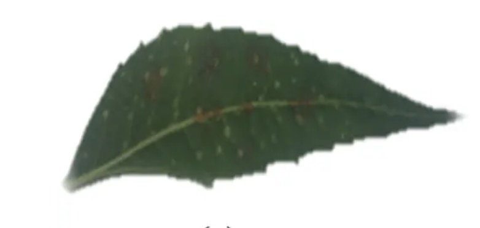
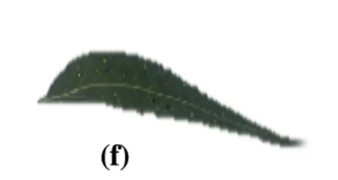
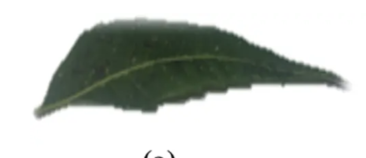
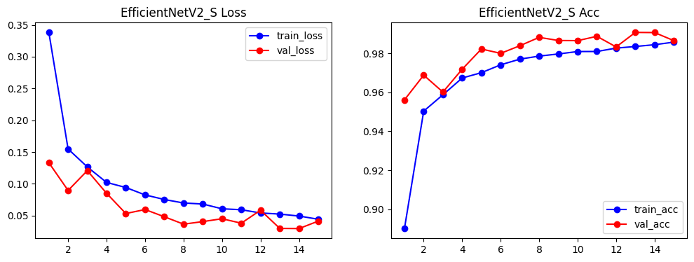
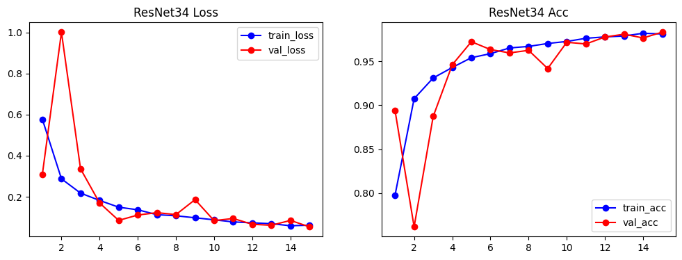
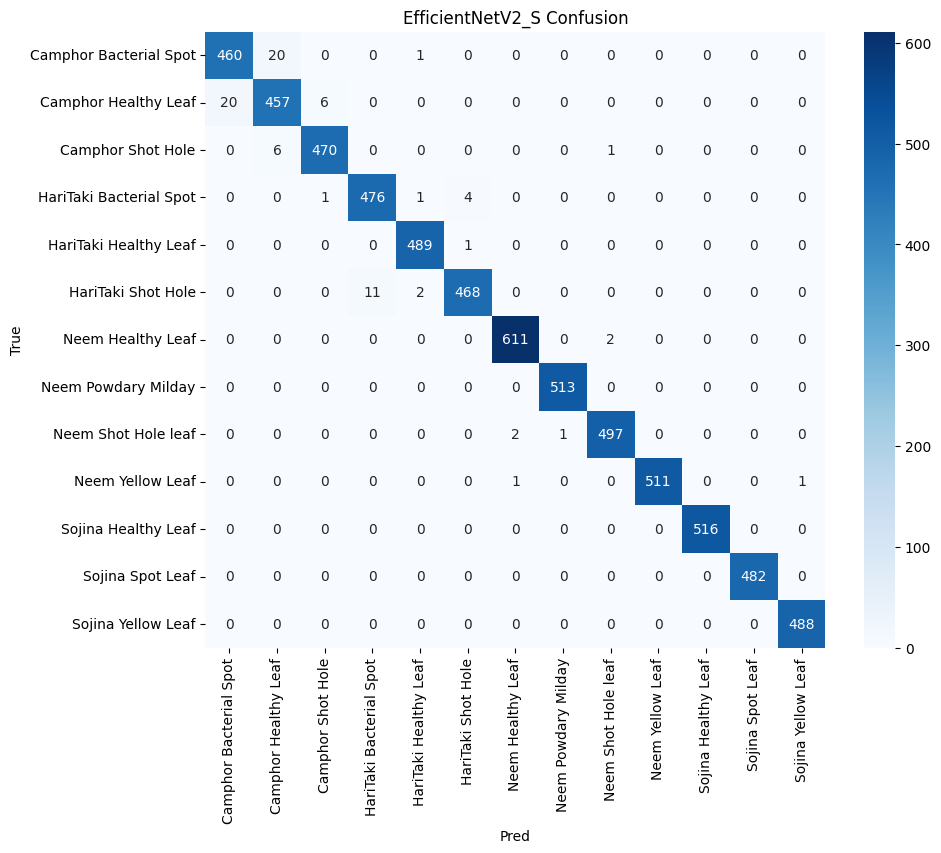

<div align="center">

# 🌿 Medicinal Leaf Disease Detection with AI-MedLeafX + XAI  
# 🌿 Nhận diện bệnh lá cây dược liệu với AI-MedLeafX + XAI

<p align="center">
  Deep learning for medicinal plant leaf disease classification with <b>ResNet</b>, <b>EfficientNetV2-S</b>, <b>ConvNeXt-Tiny</b>, and explainability using <b>Grad-CAM</b> & <b>t-SNE</b>.<br/>
  Ứng dụng học sâu cho bài toán phân loại bệnh trên lá cây dược liệu với <b>ResNet</b>, <b>EfficientNetV2-S</b>, <b>ConvNeXt-Tiny</b>, kết hợp giải thích mô hình bằng <b>Grad-CAM</b> và <b>t-SNE</b>.
</p>

<p align="center">
  
  
  
  
  
  
</p>

</div>

---

## 📌 Overview | Tổng quan

**EN**  
This project focuses on **medicinal plant leaf disease classification** using deep learning on the **AI-MedLeafX** dataset. Besides classification performance, the project also emphasizes **model interpretability** through Explainable AI (XAI) techniques such as **Grad-CAM** and **t-SNE**.

**VI**  
Dự án tập trung vào bài toán **phân loại bệnh trên lá cây dược liệu** bằng học sâu trên bộ dữ liệu **AI-MedLeafX**. Bên cạnh hiệu năng phân loại, dự án còn chú trọng đến **khả năng giải thích mô hình** thông qua các kỹ thuật Explainable AI (XAI) như **Grad-CAM** và **t-SNE**.

### Main objectives | Mục tiêu chính
- **EN:** Classify diseases on medicinal plant leaves from RGB images.  
  **VI:** Phân loại bệnh trên lá cây dược liệu từ ảnh RGB.
- **EN:** Compare multiple CNN architectures on the same dataset.  
  **VI:** So sánh nhiều kiến trúc CNN trên cùng một bộ dữ liệu.
- **EN:** Analyze model decisions using XAI.  
  **VI:** Phân tích quyết định của mô hình bằng XAI.
- **EN:** Build a strong baseline for future real-world agricultural applications.  
  **VI:** Xây dựng nền tảng baseline mạnh cho các ứng dụng nông nghiệp thực tế sau này.

---

## ✨ Highlights | Điểm nổi bật
- ✅ **EN:** Fine-tuning pretrained CNN models on **AI-MedLeafX**  
  **VI:** Fine-tune các mô hình CNN pretrained trên **AI-MedLeafX**
- ✅ **EN:** Comparison of **ResNet50**, **EfficientNetV2-S**, and **ConvNeXt-Tiny**  
  **VI:** So sánh **ResNet50**, **EfficientNetV2-S**, và **ConvNeXt-Tiny**
- ✅ **EN:** Explainability with **Grad-CAM** and **t-SNE**  
  **VI:** Giải thích mô hình bằng **Grad-CAM** và **t-SNE**
- ✅ **EN:** Strong performance with **98.16% accuracy** from ConvNeXt-Tiny  
  **VI:** Hiệu năng nổi bật với **98.16% accuracy** từ ConvNeXt-Tiny
- ✅ **EN:** Organized notebooks for training, evaluation, and XAI experiments  
  **VI:** Notebook được tổ chức cho huấn luyện, đánh giá và thử nghiệm XAI

---

## 🖼️ Project Preview | Minh họa dự án

### Sample leaf images | Ảnh mẫu lá cây
<p align="center">
  
  
  
  
  
</p>

### Example result visualizations | Ví dụ ảnh kết quả
<p align="center">
  
  
  
</p>

> **EN:** You can later replace these images with cleaner pipeline diagrams, confusion matrices, or Grad-CAM outputs for a more polished GitHub presentation.  
> **VI:** Sau này bạn có thể thay các ảnh này bằng sơ đồ pipeline, confusion matrix hoặc Grad-CAM đẹp hơn để README nhìn chuyên nghiệp hơn nữa.

---

## 📚 Table of Contents | Mục lục
- [Overview | Tổng quan](#-overview--tổng-quan)
- [Highlights | Điểm nổi bật](#-highlights--điểm-nổi-bật)
- [Project Preview | Minh họa dự án](#️-project-preview--minh-họa-dự-án)
- [Problem Statement | Bài toán](#-problem-statement--bài-toán)
- [Dataset | Bộ dữ liệu](#-dataset--bộ-dữ-liệu)
- [Models | Mô hình](#-models--mô-hình)
- [Methodology | Phương pháp](#️-methodology--phương-pháp)
- [Results | Kết quả](#-results--kết-quả)
- [Explainable AI | Giải thích mô hình](#-explainable-ai--giải-thích-mô-hình)
- [Project Structure | Cấu trúc thư mục](#-project-structure--cấu-trúc-thư-mục)
- [Installation | Cài đặt](#-installation--cài-đặt)
- [Quick Start | Chạy nhanh](#-quick-start--chạy-nhanh)
- [Inference on New Images | Dự đoán ảnh mới](#-inference-on-new-images--dự-đoán-ảnh-mới)
- [How to Upload to GitHub | Cách đưa lên GitHub](#-how-to-upload-to-github--cách-đưa-lên-github)
- [Limitations | Hạn chế](#️-limitations--hạn-chế)
- [Future Work | Hướng phát triển](#-future-work--hướng-phát-triển)
- [Authors | Tác giả](#-authors--tác-giả)
- [Acknowledgement | Lời cảm ơn](#-acknowledgement--lời-cảm-ơn)

---

## 🎯 Problem Statement | Bài toán

**EN**  
Early detection of plant diseases is important for reducing crop damage and improving decision-making in smart agriculture. Unlike many previous works that focus on common agricultural crops, this project targets **medicinal plants**, which are less studied and have more limited public datasets.

**VI**  
Phát hiện sớm bệnh trên cây là yếu tố quan trọng để giảm thiệt hại và hỗ trợ ra quyết định trong nông nghiệp thông minh. Khác với nhiều nghiên cứu trước đây tập trung vào cây nông nghiệp phổ biến, dự án này hướng đến **cây dược liệu**, một hướng còn ít được nghiên cứu và có dữ liệu công khai hạn chế hơn.

---

## 🧪 Dataset | Bộ dữ liệu

**EN**  
The project uses **AI-MedLeafX**, a medicinal plant disease dataset containing **4 plant species** and **13 classes**.

**VI**  
Dự án sử dụng **AI-MedLeafX**, bộ dữ liệu về bệnh lá cây dược liệu gồm **4 loài cây** và **13 lớp**.

### Plant species | Loài cây
- Camphor
- HariTaki
- Neem
- Sojina

### Disease categories | Nhóm bệnh
- Bacterial Spot
- Shot Hole
- Powdery Mildew
- Yellow Leaf
- Healthy Leaf

### Input setting | Thiết lập đầu vào
- **EN:** Image size: **224 × 224**  
  **VI:** Kích thước ảnh: **224 × 224**
- **EN:** Data format: RGB images  
  **VI:** Dữ liệu ảnh RGB
- **EN:** Preprocessing based on **ImageNet normalization**  
  **VI:** Tiền xử lý theo chuẩn hóa **ImageNet**

### Split used in notebook | Tỉ lệ chia trong notebook
- Train: 70%
- Validation: 20%
- Test: 10%

### Observed dataset size in notebook | Kích thước quan sát được trong notebook
- **65,178 images**
- **13 classes**
- Train: **45,624**
- Validation: **13,035**
- Test: **6,519**

> **EN:** The original report mentions the base AI-MedLeafX dataset at around **10,858 images**. The notebook appears to use an augmented version.  
> **VI:** Báo cáo gốc nêu bộ AI-MedLeafX khoảng **10,858 ảnh**, nhưng notebook đang dùng phiên bản đã tăng cường dữ liệu nên số lượng lớn hơn.

---

## 🧠 Models | Mô hình

### 1. ResNet50
**EN:** A strong baseline CNN with residual connections for stable deep training.  
**VI:** Mô hình baseline mạnh với residual connection giúp huấn luyện mạng sâu ổn định.

### 2. EfficientNetV2-S
**EN:** A more efficient architecture balancing accuracy and computational cost.  
**VI:** Kiến trúc tối ưu cân bằng giữa độ chính xác và chi phí tính toán.

### 3. ConvNeXt-Tiny
**EN:** A modern ConvNet inspired by Vision Transformer design ideas, achieving the best result in this project.  
**VI:** CNN hiện đại lấy cảm hứng từ Vision Transformer và cho kết quả tốt nhất trong dự án này.

---

## ⚙️ Methodology | Phương pháp

```text
Input Images
   ↓
Preprocessing & Augmentation
   ↓
Train / Validation / Test Split
   ↓
Fine-tune Pretrained CNN Models
   ↓
Evaluation Metrics
   ↓
XAI Analysis (Grad-CAM, t-SNE)
```

### Preprocessing | Tiền xử lý
Implemented using `torchvision.transforms`:
- Resize to `224x224`
- Random horizontal flip
- Random rotation
- Convert to tensor
- Normalize with ImageNet mean/std

### Training strategy | Chiến lược huấn luyện
**EN**
- Pretrained ImageNet weights
- AdamW optimizer
- Cross-Entropy Loss
- Early stopping
- ReduceLROnPlateau
- Two-stage training strategy

**VI**
- Sử dụng trọng số pretrained từ ImageNet
- Tối ưu bằng AdamW
- Hàm mất mát Cross-Entropy Loss
- Early stopping
- ReduceLROnPlateau
- Huấn luyện hai giai đoạn

### Evaluation metrics | Chỉ số đánh giá
- Accuracy
- Precision
- Recall
- F1-score
- ROC-AUC
- Confusion Matrix

---

## 📊 Results | Kết quả

| Model | Accuracy (%) | Precision | Recall | F1-score | Params |
|------|-------------:|----------:|-------:|---------:|------:|
| ResNet50 | 95.03 | 0.95 | 0.95 | 0.95 | ~24M |
| EfficientNetV2-S | 96.06 | 0.97 | 0.97 | 0.97 | ~21M |
| ConvNeXt-Tiny | **98.16** | **0.98** | **0.98** | **0.98** | ~28M |

### Key observations | Nhận xét chính
- **EN:** ConvNeXt-Tiny achieved the best overall performance.  
  **VI:** ConvNeXt-Tiny cho hiệu năng tổng thể tốt nhất.
- **EN:** EfficientNetV2-S provides a strong balance between accuracy and efficiency.  
  **VI:** EfficientNetV2-S cân bằng tốt giữa độ chính xác và hiệu quả tính toán.
- **EN:** ResNet50 remains a reliable baseline.  
  **VI:** ResNet50 vẫn là baseline ổn định và đáng tin cậy.

---

## 🔍 Explainable AI | Giải thích mô hình

### Grad-CAM
**EN:** Grad-CAM identifies the image regions that most influence the final prediction.  
**VI:** Grad-CAM giúp xác định vùng ảnh ảnh hưởng mạnh nhất đến dự đoán cuối cùng.

**Findings | Nhận xét:**
- Good localization on **Bacterial Spot** and **Shot Hole**.
- Distributed attention for **Healthy Leaf**.
- More difficulty with **Powdery Mildew** due to diffuse symptoms.

### t-SNE
**EN:** `t-SNE` visualizes learned feature embeddings in 2D.  
**VI:** `t-SNE` trực quan hóa không gian đặc trưng mà mô hình học được trong 2D.

**Observations | Quan sát:**
- ResNet50 forms reasonably separated clusters.
- EfficientNetV2-S gives the clearest class separation.
- ConvNeXt-Tiny forms denser clusters but still performs best.

---

## 🗂 Project Structure | Cấu trúc thư mục
```text
.
├── README.md
├── requirements.txt
├── assets/
│   └── images/
├── Nhom_01_NhanDienBenhTrenLaCay.docx
├── medleaf-disease-detection (2).ipynb
├── test.ipynb
├── content/
│   └── ai-medleafx/
├── results/
├── drive_outputs/
├── n/
├── e/
├── EfficientNetV2_S.pth
├── EfficientNetV2_S_final.pth
├── EfficientNetV2_S_stage1_best.pth
└── EfficientNetV2_S_stage2_best.pth
```

### Important files | File quan trọng
- **`README.md`** — Project introduction / Giới thiệu dự án
- **`requirements.txt`** — Python dependencies / Danh sách thư viện Python
- **`assets/images/`** — Preview images for GitHub / Ảnh minh họa cho GitHub
- **`Nhom_01_NhanDienBenhTrenLaCay.docx`** — Full report / Báo cáo đầy đủ
- **`medleaf-disease-detection (2).ipynb`** — Main notebook / Notebook chính
- **`test.ipynb`** — Inference and XAI notebook / Notebook dự đoán và XAI

---

## 🚀 Installation | Cài đặt

### Install dependencies | Cài thư viện
```bash
pip install -r requirements.txt
```

### Kaggle API setup | Cấu hình Kaggle API
Place your Kaggle API file at / Đặt file `kaggle.json` tại:

```bash
~/.kaggle/kaggle.json
```

Set permissions / Cấp quyền:

```bash
chmod 600 ~/.kaggle/kaggle.json
```

---

## ⚡ Quick Start | Chạy nhanh

### 1. Launch Jupyter | Mở Jupyter
```bash
jupyter notebook
```

### 2. Open the main notebook | Mở notebook chính
```text
medleaf-disease-detection (2).ipynb
```

### 3. Download dataset | Tải dữ liệu
Notebook uses a command similar to / Notebook sử dụng lệnh tương tự:

```bash
kaggle datasets download -d mrlocbap/ai-medleafx
```

### 4. Extract data | Giải nén dữ liệu
The notebook extracts data into / Notebook giải nén vào:

```text
content/ai-medleafx
```

### 5. Train and evaluate | Huấn luyện và đánh giá
Main tasks include / Các bước chính gồm:
- loading images by class / đọc ảnh theo lớp
- train/val/test split / chia dữ liệu
- fine-tuning pretrained models / fine-tune mô hình pretrained
- saving checkpoints / lưu checkpoint
- evaluating results / đánh giá kết quả
- visualizing XAI / trực quan hóa XAI

---

## 🖼 Inference on New Images | Dự đoán ảnh mới

The `test.ipynb` notebook includes helper functions for / `test.ipynb` có sẵn các hàm hỗ trợ:
- single-image prediction / dự đoán ảnh đơn
- Grad-CAM visualization / hiển thị Grad-CAM
- LIME explanation / giải thích bằng LIME
- loading trained `.pth` weights / nạp trọng số `.pth`

Typical inference flow / Quy trình cơ bản:
1. Load model checkpoint  
2. Apply test transform  
3. Run forward pass  
4. Return predicted class and confidence score

---

## ☁️ How to Upload to GitHub | Cách đưa lên GitHub

### Option 1: Using GitHub website | Cách 1: Dùng giao diện GitHub

**EN**
1. Go to <https://github.com>
2. Click **New repository**
3. Enter repository name, e.g. `medicinal-leaf-disease-detection`
4. Choose **Public** or **Private**
5. Click **Create repository**
6. Upload files from this folder:
   - `README.md`
   - `requirements.txt`
   - `assets/`
   - notebooks `.ipynb`
   - report `.docx` if you want
7. Commit changes

**VI**
1. Vào <https://github.com>
2. Chọn **New repository**
3. Đặt tên repo, ví dụ: `medicinal-leaf-disease-detection`
4. Chọn **Public** hoặc **Private**
5. Bấm **Create repository**
6. Tải các file từ thư mục này lên:
   - `README.md`
   - `requirements.txt`
   - `assets/`
   - các notebook `.ipynb`
   - file báo cáo `.docx` nếu muốn
7. Commit lại là xong

### Option 2: Using Git command line | Cách 2: Dùng lệnh Git

> Run these commands inside the project folder.  
> Chạy các lệnh này trong thư mục dự án.

```bash
cd "/Users/hongviet/Documents/ComputerVision/đề án cuối kì"
git init
git add README.md requirements.txt assets *.ipynb *.docx
git commit -m "Initial commit"
git branch -M main
git remote add origin https://github.com/YOUR_USERNAME/YOUR_REPOSITORY.git
git push -u origin main
```

### If Git asks for login | Nếu Git yêu cầu đăng nhập

**EN**  
Use one of these methods:
- GitHub Desktop
- Personal Access Token (PAT)
- GitHub CLI (`gh auth login`)

**VI**  
Bạn có thể dùng một trong các cách sau:
- GitHub Desktop
- Personal Access Token (PAT)
- GitHub CLI (`gh auth login`)

### Recommended `.gitignore` | `.gitignore` nên dùng
If you want, create a file named `.gitignore` with:

```gitignore
.venv/
__pycache__/
.ipynb_checkpoints/
*.pth
*.h5
results.zip
.DS_Store
content/
drive_outputs/
```

> **EN:** This helps avoid pushing large model files and temporary folders.  
> **VI:** File này giúp tránh đẩy lên GitHub các model nặng và thư mục tạm.

---

## ⚠️ Limitations | Hạn chế
- **EN:** Training data is mostly collected in controlled conditions.  
  **VI:** Dữ liệu huấn luyện chủ yếu được thu trong điều kiện kiểm soát.
- **EN:** Diffuse diseases such as powdery mildew remain harder to localize.  
  **VI:** Những bệnh lan tỏa như phấn trắng vẫn khó định vị chính xác hơn.
- **EN:** The system has not yet been deployed as a real-time application.  
  **VI:** Hệ thống hiện chưa được triển khai thành ứng dụng thời gian thực.

---

## 🔮 Future Work | Hướng phát triển
- train on real-world field images / huấn luyện trên ảnh thực địa
- try ViT, Swin Transformer, hybrid models / thử ViT, Swin Transformer, mô hình lai
- add SHAP and richer XAI analysis / bổ sung SHAP và phân tích XAI sâu hơn
- build a user-friendly app / xây dựng ứng dụng thân thiện hơn
- deploy on mobile or drones / triển khai trên mobile hoặc drone

---

## 👥 Authors | Tác giả
<div align="center">

| Name | Student ID | Role |
|------|------------|------|
| **Võ Hồng Việt** | `22725461` | Team member |
| **Trần Quang Lộc** | `22732861` | Team member |
| **Trương Lâm Nhựt** | `22721871` | Team member |

</div>

---

## 🙏 Acknowledgement | Lời cảm ơn
- **Supervisor | Giảng viên hướng dẫn:** TS. Lê Thị Vĩnh Thanh  
- **Course | Môn học:** Thị giác máy tính và ứng dụng  
- **Institution | Trường:** Trường Đại học Công nghiệp TP.HCM

---

## 📄 Internal Sources | Nguồn tổng hợp nội bộ
This README was consolidated from / README này được tổng hợp từ:
- `Nhom_01_NhanDienBenhTrenLaCay.docx`
- `medleaf-disease-detection (2).ipynb`
- `test.ipynb`
